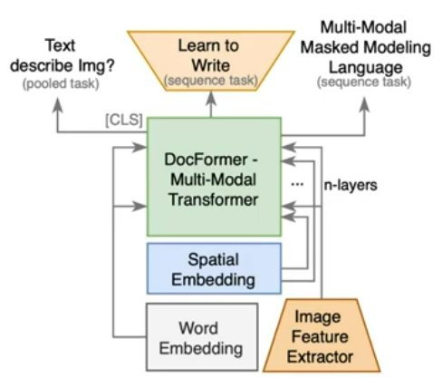
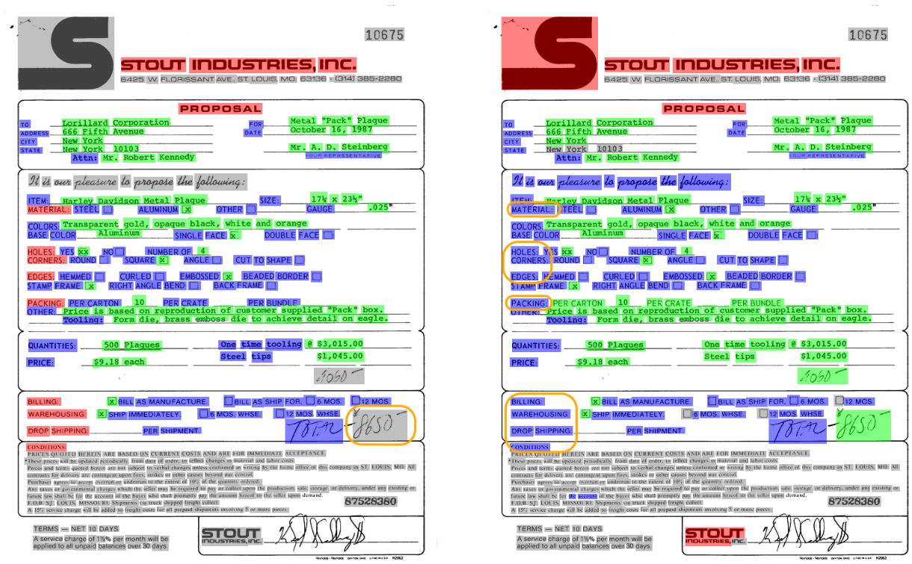

<!-- README.md is generated from README.Rmd. Please edit that file -->

```{r, include = FALSE}
knitr::opts_chunk$set(
  collapse = TRUE,
  comment = "#>",
  fig.path = "man/figures/README-",
  out.width = "100%"
)
```

# docformer

<!-- badges: start -->
<!-- badges: end -->

{docformer} is an implementation of [DocFormer: End-to-End Transformer for Document Understanding](https://arxiv.org/abs/2106.11539) relying on [torch for R](https://torch.mlverse.org/resources/) providing a multi-modal transformer based architecture for the task of Visual Document Understanding (VDU) 📄📄📄, as a port of [shabie/docformer](https://github.com/shabie/docformer) code.

DocFormer uses text, vision and spatial features and combines them using a novel multi-modal self-attention layer. DocFormer can be pre-trained in an unsupervised fashion using carefully designed tasks which encourage multi-modal interaction. DocFormer also shares learned spatial embeddings across modalities which makes it easy for the model to correlate text to visual tokens and vice versa. DocFormer is evaluated on 4 different datasets each with strong baselines. DocFormer achieves state-of-the-art results on all of them, sometimes beating models 4x larger in no. of parameters.


## Installation

You can install the development version of docformer like so:

```{r}
# install.packages("remotes")
remotes::install_github("cregouby/docformer")
```

docformer currently supports the `{sentencepiece}` package for
tokenization prerequisites, and relies on `{pdftools}` for digitally born pdfs, and `{tesseract}` with `{magick}` for OCR documents.

```{r}
install.packages("sentencepiece")
```

## Example (Work in Progress)



This is a basic workflow to train a docformer model:

```{r example}
library(sentencepiece)
library(docformer)
# get the corpus
doc <- pins::pin("https://arxiv.org/pdf/2106.11539.pdf")

# train a sentencepiece tokenizer
doc_txt <- pdftools::pdf_text(doc)
tmp <- tempfile()
readr::write_lines(doc_txt, file=tmp)
tok_model <- sentencepiece(tmp, type="bpe", vocab_size = 3000, verbose=T )

# turn the document into docformer input tensor
doc_tensor <- create_features_from_doc(doc = doc, tokenizer = tok_model)
```


